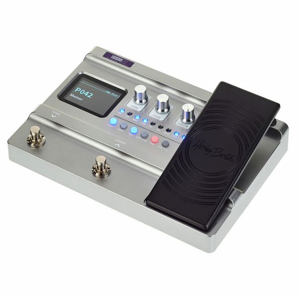

* <a href="https://rainerlueers.github.io/Gitarrenschule/">Rainer's Gitarrenschule</a>

---
title: Rainer's Gitarrenschule
---  

## Harley Benton DNAfx GiT

Multieffektpedal für E-Gitarre

### Rezensionen und mehr...

Infos zum Gerät | 
---------|
<a href="https://www.youtube.com/watch?v=fQUXrB_SDM8" target="_blank">Bernd Kiltz rezensiert DNAfx GiT</a> | 
<a href="https://www.youtube.com/watch?v=_hr5lN6EHwg" target="_blank">Bernd Kiltz Mini-Tutorial DNAfx GiT</a> | 
<a href="https://www.youtube.com/watch?v=g4x55JnDKKs" target="_blank">Bernd Kiltz Brot-und-Butter Sounds für Harley Benton DNAfx Git und MOOER GE150</a> |

### Software
<a href="https://rainerlueers.github.io/Gitarrenschule/Software/DnaFx_setup_windows_v1_04.zip" target="_blank" rel="noopener noreferrer" >Setup - DNAfx GiT - Interface</a>  

<a href="#">Top</a> 
